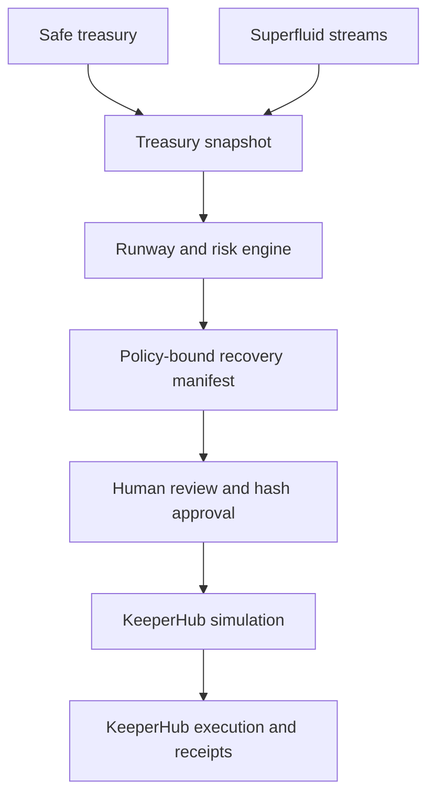
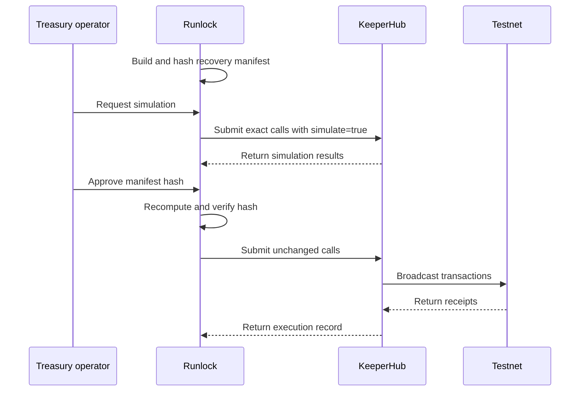

# Runlock

**The autonomous survival layer for onchain treasuries.**

[](https://github.com/Fatumayattani/runlock/actions/workflows/ci.yml)
[](LICENSE)

Runlock detects when an onchain treasury is approaching an operational runway crisis, prepares a policy-compliant recovery plan, and routes the exact approved actions through KeeperHub for deterministic simulation and execution.

An agent can recommend what should happen. It should not reinterpret that recommendation while moving funds. Runlock separates treasury intelligence from transaction execution: the recovery plan is compiled, reviewed, hashed, simulated and approved before any transaction is broadcast.

> Built for the KeeperHub Integrations Hackathon: KeeperHub is the execution layer, Safe is the treasury, and Superfluid streams are the recurring obligations Runlock protects and manages.

## The problem

Onchain treasuries can hold assets and still fail operationally.

A treasury team may have funds spread across liquid balances and SuperTokens while continuous streams keep draining reserves. By the time a low balance becomes obvious, the team is already choosing between interrupting critical payments and making rushed transactions.

Existing dashboards show balances. Runlock answers the harder questions:

- How many days can this treasury continue operating?
- Which obligations are driving the burn?
- Which payments must never be interrupted?
- What is the smallest policy-compliant intervention?
- Can the intervention be simulated exactly before execution?
- Can every resulting action be verified afterward?

## How Runlock works



1. Runlock reads the configured Safe balances and active Superfluid streams.
2. The runway engine calculates net burn, protected reserves and the estimated depletion time.
3. If runway falls below policy, Runlock compiles a deterministic recovery manifest.
4. Policy checks reject unsafe chains, contracts, values or protected recipients.
5. The complete manifest is canonicalized and committed to a SHA-256 hash.
6. KeeperHub simulates the exact contract calls contained in that manifest.
7. A human approves the displayed hash.
8. Runlock recomputes the hash and sends the unchanged calls to KeeperHub.
9. Transaction receipts and idempotency keys create an auditable execution record.

Nothing is inferred at execution time.

## Demonstration scenario

The included scenario models a treasury with only **19.4 days of runway**, below its **21-day minimum**.

| Treasury signal | Value |
| --- | ---: |
| Liquid operating reserves | 530 stablecoin and SuperToken |
| Net monthly burn | 820 stablecoin |
| Current runway | 19.4 days |
| Minimum permitted runway | 21 days |
| Target recovery runway | 30 days |

Core engineering and operations payments are protected by policy. Runlock therefore prepares three bounded actions:

1. Wrap 75 stablecoin into SuperToken to support streaming liquidity.
2. Reduce the non-protected community rewards stream.
3. Pause the non-critical experimental tooling stream.

The resulting plan restores projected runway to 30 days without touching protected recipients. KeeperHub receives the exact reviewed calls for simulation and, only after approval, testnet execution.

## Why KeeperHub is essential

Runlock does not use KeeperHub as a generic transaction relay. KeeperHub provides the execution boundary between an analytical treasury agent and onchain value movement.

| KeeperHub capability | Runlock usage |
| --- | --- |
| Contract-call execution | Executes compiled Safe and Superfluid recovery actions |
| Simulation | Preflights the same calldata later used for execution |
| Idempotency | Prevents retries from duplicating completed actions |
| Retry infrastructure | Handles recoverable failures without regenerating the plan |
| Audit trail | Connects each manifest action to its execution result |
| Non-custodial infrastructure | Keeps signing outside the analytical agent |

Runlock uses `POST /api/execute/contract-call` for both preflight and execution. Superfluid operations are compiled into explicit contract calls because the execution payload must remain identical after approval.

## Deterministic execution

The recovery manifest contains:

- Treasury snapshot
- Policy version
- Network and contract addresses
- Ordered recovery actions
- Exact calldata and transaction values
- Creation and expiry timestamps
- Expected runway improvement

The complete manifest is canonicalized and hashed.

Simulation, approval and execution must all reference that same hash. If balances, policy, actions or calldata change, the hash changes and the previous approval becomes invalid.

## Safety model

Runlock fails closed. Execution is rejected unless:

- The chain is explicitly allowed by treasury policy.
- Every target contract is allowlisted.
- No action modifies a protected recipient.
- Every action remains below its configured value ceiling.
- The recovery manifest has not expired.
- KeeperHub simulation succeeded.
- The approved hash matches the server-recomputed hash.
- The execution payload matches the simulated payload.
- The action has not already completed under its idempotency key.

The first failed action stops the sequence. A partially completed plan can resume from the first incomplete action without repeating successful transactions.

## Current implementation

| Capability | Status |
| --- | --- |
| Deterministic runway calculation | Implemented |
| Risk classification | Implemented |
| Recovery-plan compiler | Implemented |
| Policy enforcement | Implemented |
| Canonical manifest hashing | Implemented |
| Protected-recipient enforcement | Implemented |
| KeeperHub execution adapter | Implemented |
| Simulation and approval gating | Implemented |
| Per-action idempotency | Implemented |
| Domain and safety tests | 17 passing |
| Live Safe integration | Implemented and verified on Ethereum Sepolia |
| Live Superfluid integration | Implemented for token balances and CFA flow reads |
| Public deployment | In progress |
| Verified KeeperHub testnet transaction | Required before submission |

### Verified Sepolia treasury

- Safe account: `0x9e604f3Aacb910a8dbdBE7B5459fB9074BC0600A`
- Configuration: one owner, threshold one
- Safe activation transaction: `0xedd0751cdbca4864aed6daddd0f95b9462f0ca0fd16dd12c0e2fd446f7c22d56`
- Live snapshot source: Ethereum Sepolia RPC
- Superfluid assets: fDAI and fDAIx
- CFA flow state: read directly from the deployed Superfluid contracts

The activation transaction proves deployment of the Safe account. It is not presented as KeeperHub execution evidence.

Demo receipts are explicitly marked with `mode: "demo"` and must never be presented as hackathon transaction evidence.

## Run locally

### Requirements

- Node.js 22.13 or newer
- pnpm 11.25.0

Clone the repository:

```bash
git clone https://github.com/Fatumayattani/runlock.git
cd runlock
```

Install dependencies:

```bash
pnpm install
```

Create the local environment file:

```bash
cp .env.example .env
```

Start Runlock:

```bash
pnpm dev
```

Runlock starts in demo mode and does not require an API key. Open the local URL printed by the terminal.

## Verify the project

```bash
pnpm test
pnpm typecheck
pnpm build
```

## Demo mode and live mode

### Demo mode

Demo mode exercises:

- Treasury runway calculations
- Risk classification
- Recovery-plan generation
- Policy enforcement
- Manifest hashing
- Simulation states
- Approval gating
- Audit history
- Idempotency behavior

It does not broadcast transactions.

### Live mode

Live broadcasting is disabled by default.

Follow [`docs/KEEPERHUB_SETUP.md`](docs/KEEPERHUB_SETUP.md) before enabling it.

```env
RUNLOCK_MODE=live
RUNLOCK_LIVE_EXECUTION=false
RUNLOCK_RPC_URL=https://ethereum-sepolia-rpc.publicnode.com
RUNLOCK_SAFE_ADDRESS=0x9e604f3Aacb910a8dbdBE7B5459fB9074BC0600A
RUNLOCK_BASE_TOKEN_ADDRESS=0x4e89088cd14064f38e5b2f309cfab9c864f9a8e6
RUNLOCK_SUPER_TOKEN_ADDRESS=0x9ce2062b085a2268e8d769ffc040f6692315fd2c
RUNLOCK_CFA_ADDRESS=0x6836F23d6171D74Ef62FcF776655aBcD2bcd62Ef
RUNLOCK_STREAMS_JSON=[...]
```

Live RPC reads require:

- An Ethereum Sepolia RPC endpoint
- A deployed Safe treasury
- Verified base-token, SuperToken and CFA contract addresses
- A JSON list of monitored Superfluid receivers

KeeperHub simulation and execution additionally require:

- A KeeperHub organization API key
- A configured KeeperHub wallet or Safe smart account
- Testnet gas and tokens
- `RUNLOCK_LIVE_EXECUTION=true` only after simulation succeeds

Never commit `.env`.

## KeeperHub execution lifecycle



## Repository structure

```text
app/
  api/
    snapshot/             Treasury snapshot endpoint
    plan/                 Recovery-plan endpoint
    keeperhub/
      simulate/           KeeperHub preflight endpoint
      execute/            KeeperHub execution endpoint
  dashboard.tsx           Treasury command center

lib/runlock/
  canonical.ts            Canonical JSON and SHA-256 commitments
  demo.ts                 Reproducible demo scenario
  keeperhub.ts            Execution and idempotency adapter
  math.ts                 Runway and flow-rate calculations
  plan.ts                 Recovery compiler and policy checks
  types.ts                Shared domain types

config/
  policy.example.json     Example treasury policy

docs/
  ARCHITECTURE.md         System boundaries and execution lifecycle
  KEEPERHUB_SETUP.md      KeeperHub configuration and safeguards
  DEMO_SCRIPT.md          Demonstration flow
  BOUNTY_ISSUE_DRAFT.md   Upstream feature proposal

tests/
  runlock.test.ts         Domain and execution-safety tests
```

## Development roadmap

Development is organized into four reviewable milestones:

1. Rebuild the Runlock treasury command center.
2. Connect live Safe and Superfluid treasury data.
3. Complete deterministic KeeperHub testnet execution.
4. Harden, deploy and prepare verifiable submission evidence.

Each milestone is tracked through a separate GitHub issue and pull request.

## Hackathon submission structure

### Main track

**Runlock: The autonomous survival layer for onchain treasuries**

This repository contains the complete Safe, Superfluid and KeeperHub integration.

### KeeperHub feature bounty

**Treasury Runway Analysis for KeeperHub**

The bounty is a separate upstream contribution to [`KeeperHub/keeperhub`](https://github.com/KeeperHub/keeperhub). It proposes a generic KeeperHub capability for calculating:

- Net treasury burn
- Remaining runway
- Estimated depletion time
- Required recovery amount
- Safe, warning or critical status
- Machine-readable policy output

Runlock does not depend on the upstream contribution being merged.

## Documentation

- [Architecture](docs/ARCHITECTURE.md)
- [KeeperHub setup](docs/KEEPERHUB_SETUP.md)
- [Demo script](docs/DEMO_SCRIPT.md)
- [KeeperHub bounty proposal](docs/BOUNTY_ISSUE_DRAFT.md)
- [Contributing](CONTRIBUTING.md)

## Contributing

Contributions should be focused, tested and connected to an existing issue.

Before opening a pull request:

```bash
pnpm test
pnpm typecheck
pnpm build
```

See [`CONTRIBUTING.md`](CONTRIBUTING.md) for the contribution workflow.

## License

[MIT](LICENSE)