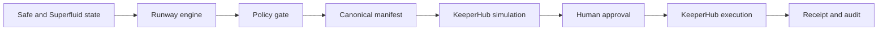

# Runlock architecture

Runlock separates observation, decision and execution so no probabilistic component can reinterpret a treasury action after approval.

## Trust boundaries

1. **Observation:** a KeeperHub monitoring workflow reads Safe owners, threshold and nonce plus Superfluid balances and streams.
2. **Decision:** Runlock calculates net burn and proposes only deterministic recovery actions.
3. **Policy:** chain, contracts, action value and protected recipients are checked before a manifest can be locked.
4. **Commitment:** canonical JSON is hashed with SHA-256. The approval header must equal that hash.
5. **Preflight:** each exact contract call is sent to KeeperHub with `simulate: true`. Nothing is signed or broadcast.
6. **Execution:** the identical bodies are sent without `simulate`. Each action receives an idempotency key derived from the manifest hash and action ID.
7. **Evidence:** KeeperHub execution IDs, transaction hashes and explorer links are retained as the run receipt.

## Failure behavior

- A stale or modified manifest is rejected.
- Any failed policy check blocks simulation and execution.
- A failed simulation stops the sequence at that action.
- Live broadcasting is disabled unless `RUNLOCK_LIVE_EXECUTION=true`.
- Actions execute sequentially. A failure stops remaining actions rather than continuing into an unknown partial state.
- Retrying the same action uses the same KeeperHub idempotency key.

## Current integration surface

The monitor uses a KeeperHub workflow because Safe support is read-only and Superfluid provides both read and write actions. Recovery uses KeeperHub's direct contract-call endpoint because it supports an exact EVM dry run before broadcast. The generated manifest contains the complete chain ID, contract address, ABI, function and arguments KeeperHub will receive.
